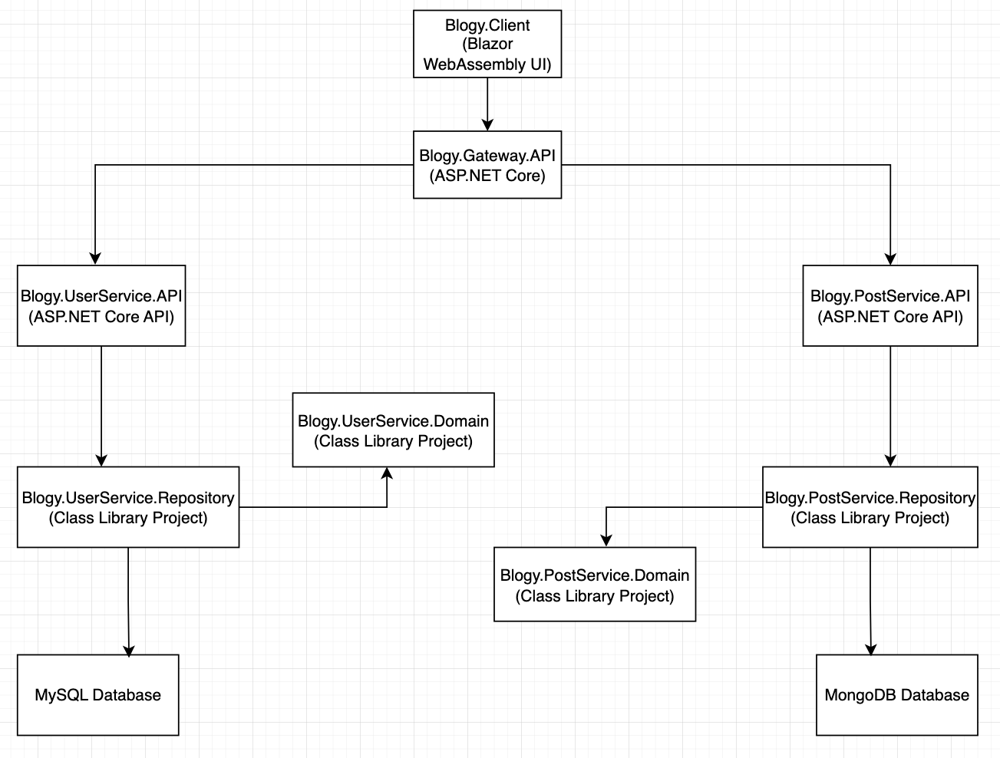
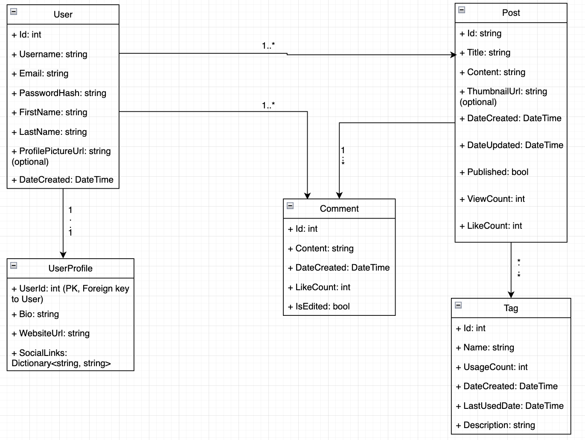

# Blogy Microservice Application

##### Overview

    Blogy is a microservices-based blog management system designed for scalability, flexibility, and modularity. Built using ASP.NET 8, Blazor WebAssembly, and MongoDB/MySQL, it demonstrates a robust, modern architecture for managing user and blog post data across distributed services. The project adheres to SOLID principles, Domain-Driven Design (DDD), and modern best practices for microservices communication and database operations.

    This project features:
    • Microservices architecture for independent scalability and modularity.

    • UserService for managing user data with MySQL.

    • PostService for managing blog post data with MongoDB.

    • A centralized Gateway API for routing and coordination.

    • An interactive Blazor WebAssembly UI for seamless user experience.

    • Implements Repository and Factory patterns for clean, maintainable code.

    • Testing suite using xUnit for unit and integration testing.

    • Adherence to modern software principles like Separation of Concerns (SoC) and MVC architecture.

## System Architecture

### Key Components:

    The system is divided into services for User Management and Post Management, with a Gateway API for unified communication and a modern Blazor WebAssembly frontend.

##### 1. Blazor WebAssembly UI

    • Purpose: Provides an interactive, responsive UI for users to manage blog content and profiles.

    • Features:
      • Sends HTTP requests to the Gateway API.

      • Displays user and post data fetched from backend services.

      • Provides responsive and user-friendly CRUD components.

      • Form validation and error handling for seamless user interaction.

##### 2. Gateway API (ASP.NET Core API)

    • Purpose: Acts as the entry point to the backend, routing requests to the appropriate microservices.

    • Features:
      • Validates incoming requests and forwards them to UserService or PostService.

      • Centralizes API communication for better manageability.

      • Implements cross-origin resource sharing (CORS) for secure frontend-backend communication.

      • Extensible design to add more services in the future.

      • The Gateway API validates tokens before forwarding requests to microservices and provides fallback error responses if services are unreachable.

      • Shield back-end services from direct access by handling security concerns at the proxy level.

##### 3. UserService (ASP.NET Core API)

    • Purpose: Manages user-related data.

    • Features:
      • CRUD operations for user profiles.

      • MongoDB was selected due to its ability to handle unstructured data, like nested tags and comments, and scale horizontally.

      • Stores user data in a MySQL database using Dapper ORM.

      • Domain logic encapsulated in the UserService.Domain class library.

##### 4. PostService (ASP.NET Core API)

    • Purpose: Manages blog post-related data.

    • Features:
      • CRUD operations for posts.

      • Stores post data in a MongoDB database for NoSQL flexibility.

      • Domain logic encapsulated in the PostService.Domain class library.

##### 5. User Domain Layer (Class Libraries)

    • Class libraries for defining domain-specific models and business logic for the User service.

##### 6. Post Domain Layer (Class Libraries)

    • Class libraries for defining domain-specific models and business logic for the Post service.

##### 7. User Repository Layer (Class Libraries)

    • Implement database interactions using Dapper ORM (UserService).

    • Perform parameterized queries to prevent SQL injection and ensure data integrity.

##### 8. Post Repository Layer (Class Libraries)

    • Implement database interactions using MongoDB Drivers (PostService).

    • Perform parameterized queries to prevent SQL injection and ensure data integrity.

### Features:

##### 1. Microservices Architecture:

    • Decouples services for independent scalability and maintainability.

    • UserService and PostService operate independently, communicating via the Gateway API.

    • Separation of Concerns: API and Repository layers are distinct, ensuring modular and maintainable code.

##### 2. Modern Frontend:

    • Built with Blazor WebAssembly for fast, interactive, and responsive UI.

    • Handles form validation and API responses to enhance user experience.

##### 3. Secure Database Management:

    • MySQL Database: Relational database for UserService, ensuring data normalization, integrity and secure and reliable storage for User data.

    • MongoDB: NoSQL database for PostService, offering scalability and flexibility for unstructured blog data.

##### 4. Dapper ORM:

    • Lightweight, high-performance and secure ORM for interacting with MySQL in the UserService.

    • Executes parameterized SQL queries for performance and security.

##### 5. RESTful APIs:

    • Expose endpoints for CRUD operations, with detailed error handling and response management.

    • Endpoint examples:
      • /users and /posts for creating new resources.

      • /users/{id} and /posts/{id} for retrieving resources by ID.

##### 6. Scalable Design:

    • Modular architecture for easy integration of new features or services.

    • Extensible Gateway API for future functionality.

##### 7.Testing:

    • Unit tests using xUnit to validate business logic and API endpoints.

    • In-memory testing for repository methods to simulate database interactions.

## Development Workflow

### Data Flow:

##### 1. Frontend (Blazor WebAssembly):

    • Sends HTTP requests to the Gateway API.

    • Displays paginated results and validates user input.

##### 2. Gateway API:

    • The Gateway API is implemented using ASP.NET Core and YARP for reverse proxying. It centralizes communication between the frontend and backend microservices.

    • The Gateway API routes the requests to the appropriate microservice (UserService or PostService).

    • Validates and routes requests to the appropriate microservice.

##### 3. UserService:

    • Processes user-related requests and interacts with the MySQL database.

##### 4. PostService:

    • Processes blog post-related requests and interacts with the MongoDB database.

### Authentication & Security:

    • Secure environment variable management using appsettings.json.

    • Endpoint protection through proper request validation.

    . Login system with OAuth.

    . Passwords are hashed using bcrypt and never stored in plain text.

## Coding Challenges

### Blazor WebAssembly

    • Create a clean, responsive UI to manage users and posts.

    • Create a Blazor component to send users and posts data to the API.

    • Implement form validation to ensure data integrity.

    • Make efficient API calls for CRUD operations and pagination.

    • Ensure a seamless user experience through form validation and feedback.

### API Development

    • Implement a RESTful API endpoint that accepts JSON payloads for user and post data.

    • Validates the endpoints and implment CORS.

    • Ensure requests are validated before forwarding them to the repository.

    • Return meaningful error messages or success responses to the frontend.

### Repository Layer

    • Write SQL queries using Dapper to interact with the MySQL database.

    • Handle parameterized queries to avoid SQL injection.

    • Return clean, domain-specific objects to the API.

### Unit Testing

    • Develop unit tests using xUnit to validate API and repository functionalities.

    • Implement in-memory testing to simulate database interactions when applicable.

    • Validate scenarios like successful CRUD operations and invalid inputs.

    • Use xUnit to test repository methods and API endpoints.

## Getting Started

### Prerequisites

    • .NET SDK 8.0
    • MySQL Database
    . MongoDB

## Installation Steps

##### 1. Clone the Repository:

    • git clone https://github.com/guiandrew-pt/Blogy-Microservice-Application.git
    cd Blogy-Microservice-Application

##### 2. Database Schema:

    • Create a MySQL(UserService) database and the necessary tables:

      CREATE TABLE Users (
          Id INT AUTO_INCREMENT PRIMARY KEY,
          Username VARCHAR(50) NOT NULL,
          Email VARCHAR(100) NOT NULL UNIQUE,
          PasswordHash VARCHAR(50) NOT NULL,
          FirstName VARCHAR(50) NOT NULL,
          LastName VARCHAR(50) NOT NULL,
          ProfilePictureUrl VARCHAR(255), -- Optional
          DateCreated DATETIME NOT NULL DEFAULT CURRENT_TIMESTAMP
      );

      CREATE TABLE UserProfile (
          UserId INT PRIMARY KEY, -- Foreign Key to User.Id
          Bio TEXT,
          WebsiteUrl VARCHAR(255),
          SocialLinks JSON,       -- Key-value pairs for social links
          FOREIGN KEY (UserId) REFERENCES Users(Id) ON DELETE CASCADE
      );

    • Create an index on MySQL to make fast performance search:

      CREATE INDEX idx_username ON Users (Username);

    • Create a MongoDB(PostService) database and the necessary tables:

      {
        "_id": "ObjectId",                      // MongoDB ObjectId for the post
        "Title": "string",                      // Required: max 30 characters
        "Content": "string",                    // Required
        "ThumbnailUrl": "string",               // Optional: URL to the thumbnail image
        "DateCreated": "ISODate",               // Required: creation date
        "DateUpdated": "ISODate",               // Required: last update date
        "Published": true,                      // Required: publication status (true/false)

        "Comment": [                           // One-to-Many Relationship: Comments on the post
          {
            "_id": "ObjectId",                  // MongoDB ObjectId for the comment
            "Content": "string",                // Required: content of the comment
            "PostId": "ObjectId",               // Reference to the related Post
            "DateCreated": "ISODate",           // Required: creation date of the comment
            "UserId": 1,                        // Required: MySQL User.Id (foreign key reference)
            "LikeCount": 10,                    // Tracks the number of likes for the comment
            "IsEdited": false                   // Tracks if the comment was edited
          }
        ],

        "TagIds": [                             // Many-to-Many Relationship with Tags (via Tag IDs)
          "ObjectId",                           // MongoDB ObjectId for the tag
          "ObjectId"                            // MongoDB ObjectId of another related tag
        ],

        "UserId": 1,                            // Required: MySQL User.Id (foreign key reference for the post author)
        "ViewCount": 100,                       // Tracks how many times the post was viewed
        "LikeCount": 25
      }

      {
        "_id": "ObjectId",                  // MongoDB ObjectId for the tag
        "Name": "string",                   // Tag name: max 30 characters
        "PostIds": [                        // Tracks which posts are using this tag
          "ObjectId",                       // MongoDB ObjectId of the related post
          "ObjectId"                        // MongoDB ObjectId of another related post
        ],

        "UsageCount": 5,                    // Tracks how often the tag is used
        "CreatedDate": "ISODate",           // When the tag was created
        "LastUsedDate": "ISODate",          // When the tag was last used
        "Description": "string"             // Short description of the tag
      }

##### 3. Gateway Configuration:

    • The Gateway is built using YARP and is configured through the appsettings.json file. Below is an example configuration:

    {
      "ReverseProxy": {
        "Routes": [
          {
            "RouteId": "user-service-route",
            "ClusterId": "user-service",
            "Match": {
              "Path": "/api/users/{**catch-all}"
            }
          },
          {
            "RouteId": "post-service-route",
            "ClusterId": "post-service",
            "Match": {
              "Path": "/api/posts/{**catch-all}"
            }
          }
        ],
        "Clusters": {
          "user-service": {
            "Destinations": {
              "user-service/destination1": {
                "Address": "http://localhost:5001"
              }
            }
          },
          "post-service": {
            "Destinations": {
              "post-service/destination1": {
                "Address": "http://localhost:5002"
              }
            }
          }
        }
      }
    }

    Setup Instructions:
      1. Install YARP via NuGet:
        dotnet add package Yarp.ReverseProxy

      2. Configure YARP in the Program.cs:

        using Yarp.ReverseProxy;

        var builder = WebApplication.CreateBuilder(args);

        // Add YARP services
        builder.Services.AddReverseProxy()
            .LoadFromConfig(builder.Configuration.GetSection("ReverseProxy"));

        var app = builder.Build();

        app.MapReverseProxy();
        app.Run();

      3. Test the Gateway API by starting the UserService and PostService on their respective ports.

##### 4. Environment Configuration:

    • Add your connection strings to the appsettings.json.

##### 5. Restore Dependencies:

    dotnet restore

##### 6. Run the Application:

    • Start the API:
      cd Blogy-Microservice-Application.API
      dotnet run

    • Launch the Blazor WebAssembly:
      cd Blogy-Microservice-Application.Web
      dotnet run

##### 7. Run Unit Tests:

    cd Blogy-Microservice-Application.Test
    dotnet test

## Features in Detail

### Blazor WebAssembly

    • Purpose: Provides the interactive, user-friendly frontend for managing Users and Posts.

    • Core Features:
      • Users and Posts Management UI:
        • Includes a dashboard for viewing, adding, editing, and deleting.

        • Displays paginated data, ensuring optimal performance for large datasets.

      • Form Handling:
        • Supports detailed forms for users data input, including validation for fields like UserName, Email, PasswordHash, FirstName, LastName, ProfilePictureUrl and DateCreated.

        • Provides immediate feedback for invalid entries, improving user experience.

      • API Integration:
        • Sends HTTP requests to the API for CRUD operations.

        • Automatically handles success and error responses from the API to notify users.

      • State Management:
        • Efficiently manages application state to minimize unnecessary re-renders.

        • Allows seamless navigation between views without reloading the page.

      • Responsive Design:
        • Built with responsiveness in mind, ensuring the interface works across devices like desktops, tablets, and mobile phones.

      • Extensibility:
        • Modular design allows the addition of new features like advanced filtering, bulk updates, or export options.

      • Error Handling:
        • Implements user-friendly error messages and fallback states for API errors, such as timeouts or unauthorized access.

      • Modern UX Features:
        • Search and filtering options for posts data.

        • Real-time updates to reflect changes without requiring full-page refreshes.

### Gateway

    The Gateway acts as the entry point for all API requests, enabling seamless communication between the frontend and backend services. It uses YARP (Yet Another Reverse Proxy) for lightweight, high-performance reverse proxying.

##### Features

##### 1. Centralized Routing

    • Routes incoming requests from the Blazor WebAssembly frontend to the appropriate microservices (e.g., UserService or PostService).

    • Simplifies service discovery and reduces direct service dependencies.

##### 2. Load Balancing

    • Distributes traffic among multiple instances of a service (if scaled horizontally).

##### 3. Security and Authentication

    • Enables token-based authentication to protect sensitive endpoints.

##### 4. Performance Enhancements

    • Implements caching and compression to improve response times for frequently accessed resources.

### RESTful APIs

    • Purpose: Acts as the intermediary between the frontend (Blazor WebAssembly) and the Repository layer.

    • Core Features:
      • Endpoints(UserService.API):
        • Provides a structured set of endpoints for managing user data.
          • Example:
            • POST /api/users for creating an user.

            • GET /api/users/{id} for retrieving an user by ID.

            • PUT /api/users/{id} for updating an user's details.

            • DELETE /api/users/{id} for removing an user.

      • Endpoints(PostService.API):
        • Provides a structured set of endpoints for managing user data.
          • Example:
            • POST /api/posts for creating an post.

            • GET /api/posts/{id} for retrieving an post by ID.

            • PUT /api/posts/{id} for updating an posts's details.

            • DELETE /api/posts/{id} for removing an post.

      • Data Validation:
        • Ensures incoming requests (e.g., user creation or post creation) are validated before reaching the Repository.

        • Example: Validates required fields like Username, Email or Title, Content before processing the request.

      • Error Handling:
        • Returns appropriate HTTP status codes (e.g., 200 OK, 400 Bad Request, 404 Not Found, 500 Internal Server Error) for various scenarios.

        • Provides detailed error messages to guide the frontend or users.

        • For example: If a user tries to access a deleted post, the Gateway returns a 404 Not Found with a helpful error message.

      • Security:
        • Sanitizes input and leverages parameterized queries via Repository layer.

        • Configurable with authentication mechanisms for protecting sensitive endpoints.

      • Modular Design:
        • Decouples business logic from the controller methods, adhering to the SOLID principles.

        • Delegates database interaction to the Repository layer, ensuring separation of concerns.

      • Extensibility:
        • Can easily integrate additional features (e.g., search, sorting) without affecting the architecture.

        • Allows for future integrations with third-party services (e.g., email notifications).

### Repository's

    • Purpose: Acts as the data access layer, responsible for directly interacting with the database.

      • Core Features:
        • CRUD Operations(UserService.Repository): Implements Create, Read, Update, and Delete functionalities for user data.
          • Example: GetUserByIdAsync(int id) retrieves a single user, while DeleteUserAsync(int id) removes an user by ID.

        • CRUD Operations(PostService.Repository): Implements Create, Read, Update, and Delete functionalities for post data.
          • Example: GetPostByIdAsync(int id) retrieves a single post, while DeletePostAsync(int id) removes an post by ID.

      • Dapper Integration(UserService.Repository):
        • Uses lightweight Dapper ORM for SQL operations.

        • Executes parameterized queries to ensure security and prevent SQL injection.

      • MongoDB Drivers Integration(PostService.Repository):
        • Make the connection with MongoDB secure for NoSQL operations.

      • Efficient Querying:
        • Supports pagination to handle large datasets efficiently.

        • Fetches only required columns to optimize performance.

      • Testability:
        • Designed to be mocked for unit tests, isolating business logic from the database layer.

        • Supports in-memory database testing for scenarios that don't require a live database.

### Unit Tests

    • Purpose: Ensures code quality and reliability by testing key components of the system.
      • Core Features:
        • Repository Tests:
          • Verifies the correctness of CRUD methods in the Repository layer.

          • Includes tests for scenarios like:
            • Successful addition of an user.

            • Retrieving an user by ID.

            • Deleting non-existent users.

            • Handling SQL errors gracefully.

      • In-Memory Database Testing:
        • Uses an in-memory database to simulate real-world database behavior.

        • Ensures that queries behave correctly without needing a live database connection.

      • API Tests:
        • Validates API endpoints to ensure proper request handling and responses.

        • Includes tests for expected HTTP status codes, such as 200 OK and 404 Not Found.

      • Blazor Component Tests:
        • (Optional, if implemented) Verifies that Blazor components render correctly and respond to user interactions.

        • Example: Ensures form validation triggers when fields are left empty.

      • Code Coverage:
        • Aims for high test coverage to minimize the chances of undetected bugs.

        • Focuses on critical components, including Repository and API logic.

        • Edge Case Testing:
          • Tests rare or unexpected inputs, such as:
            • Adding users with invalid data formats.

            • Retrieving users from an empty database.

            • Handling API timeouts or malformed requests.

## Contribution Guidelines

    1. Fork the repository.

    2. Create a feature branch:
      git checkout -b feature/new-feature

    3. Commit your changes:
      git commit -m "Add a new feature"

    4. Push to the branch:
      git push origin feature/new-feature

    5. Open a Pull Request.

    6. All methods should use PascalCase, and variables should use camelCase.

    7. Contributors shold write unit tests for their changes before submitting a pull request.

## Contact

    For any queries or feedback, please reach out to:
      • Email: your-email@example.com

      • GitHub: https://github.com/guiandrew-pt

### Screenshots

    1 - Architecture Diagram;

  

    2 - Models Diagram;

  

